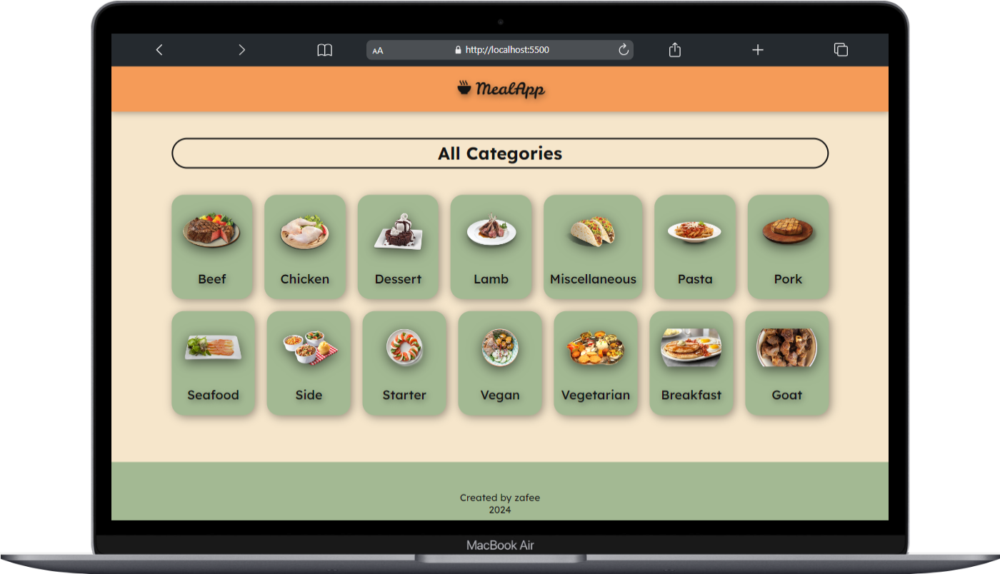
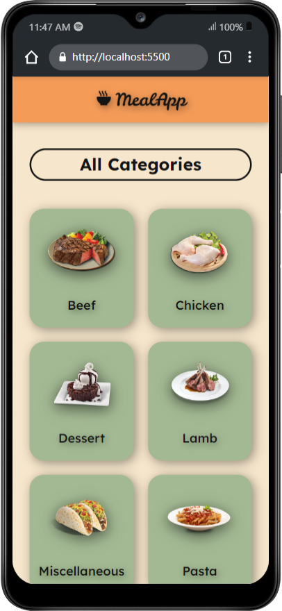

# cmlabs-frontend-internship-test

### How to run
- Make sure you're connected to the Internet.
- Clone this repository.
- Open index.html with <strong>local server/live server</strong>.

### Live demo: https://mealapp-izzafi.netlify.app/

### App example

